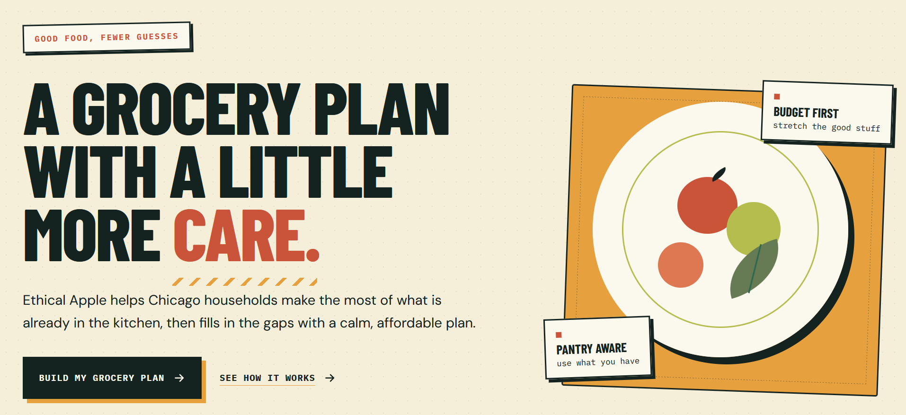

# Ethical Apple

## Local AI and pricing integration

Run `npm run dev` to start the frontend and local planning API together. Ollama uses the backend `OLLAMA_MODEL` setting. Sample-price mode works without a grocery API key; reported-price mode requires a backend credential and reviewed product mappings. See [setup, limitations, and deployment notes](docs/ollama-integration.md). Run `npm test` and `npm run build` to verify changes.

The Version 1 description below documents the original sample-only implementation; the local flow now uses a backend-validated plan.



🚧 [View Live App](ethical-apple-grocery-plan.vercel.app)

A grocery budgeting and meal-planning app for Chicago residents.

**Program:** Next Chapter Project — Week 3, Phase 1 Gate ("The AI-Built Solution")
**Author:** Kendra Hartnett

## What it does

Tell Ethical Apple your grocery budget, household size, how many days it needs to cover, and what food you already have on hand — it builds a realistic meal plan and itemized shopping list that fits your budget, then compares nearby Chicago grocery stores on estimated cost and approximate distance so you can decide where to shop.

## Problem

People shopping on very limited grocery budgets often have difficulty determining how to turn the money they have available into enough food and meals to last until they can shop again. Planning requires balancing budget, household size, number of days, existing food at home, dietary needs, nutrition, and grocery prices — all at once, which can lead to overspending, food waste, or food that doesn't stretch far enough.

See `mvp-plan.md` for the full problem statement, scope, and user stories.

## Current version — Version 1

This is the currently built version: a fully working front end with **no external API calls**. All budgeting, meal-selection, and store-comparison logic is Kendra's own hand-written JavaScript, running against a controlled sample dataset (illustrative grocery prices, six Chicago-area stores, and simple meal templates). Store distance is currently a sample placeholder value — see "Future plans" below.

The visual design/UI shell was generated with Replit (a Vite-based front end); **all decision-making logic was written and tested independently, then wired into that UI** — Replit's own built-in sample logic was replaced entirely with Kendra's own code (`src/planLogic.js` / `src/data.js`).

### Supported stores

Six sample Chicago-area stores are currently included in `src/data.js`: Aldi (Logan Square), Jewel-Osco (Lincoln Park), Food 4 Less (Pilsen), Walmart Supercenter (North Ave), Target (Logan Square/Milwaukee Ave), and Rico Fresh Market. Prices, coverage, and distance for each are sample/illustrative figures, not live retailer data.

### Project structure

```
ethical-apple/
├── index.html          (Vite entry point — Replit-generated markup/shell)
├── package.json         (Vite project config + scripts)
├── vite.config.js        (Vite build/dev server config)
├── public/
│   └── favicon.svg
└── src/
    ├── main.js          
    ├── data.js          (Controlled dataset: grocery items, sample
    │                      store prices/details, meal templates)
    ├── planLogic.js      (Kendra's own decision-making logic: budget math, meal
    │                      selection, shopping list, store comparison/sorting)
    ├── styles.css        (Directed by builder Replit-generated visual system)
    └── reference.css     (Directed by builder Replit-generated supporting styles)
```

Run locally with `npm install` then `npm run dev` (or `npm run build` / `npm run preview` for a production build).

## Future plans (not yet built)

- **Version 2 — real location/distance.** Swap the sample `sampleDistanceMiles` placeholder for real distance, using the free US Census Geocoder (no API key/account needed — chosen after Mapbox turned out to require a payment method) plus a self-written Haversine formula.
- **Version 3 — hybrid LLM meal-plan enhancement.** Add OpenAI-generated meal ideas behind one small serverless function that holds the secret API key. The LLM will only ever be allowed to suggest meal ideas from a pre-approved ingredient list; Kendra's own JavaScript validates every response and continues to own all pricing, budget, and store-comparison decisions. Guiding principle: *"AI generates suggestions. My application validates decisions."*

Both are deliberately deferred so the core mechanics are fully working and fully Kendra's own before any external API or AI is introduced — see `mvp-plan.md` for the full phased architecture.

## Project docs

- `mvp-plan.md` — problem statement, scope (in/out), and user stories
- `ea-prompt-log.md` — verbatim log of every prompt used to build this project, kept for the gate's Fluency/Control evidence

## Status

Version 1 is built, tested, and committed. Replit's UI shell is wired to Kendra's own tested logic (verified via unit-style tests, a Vite production build, and a full Playwright end-to-end browser test across all 4 screens). Six sample stores are supported. Version 2 and Version 3 are planned next.

## Limitations (disclosed intentionally)

- Store prices shown are sample/illustrative figures, not live pricing.
- Distances shown are a fixed sample placeholder in this version (not yet real — see Version 2 above).
- Only a small set of Chicago stores and staple items are supported in this MVP.
